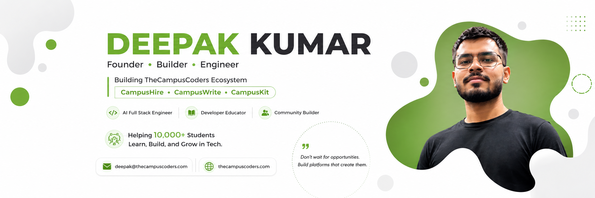

<div align="center">
  

  <h1>Hi, I'm Deepak Kumar 👋</h1>

  <p>
    <strong>AI Full Stack Engineer • MERN Developer • Founder @ TheCampusCoders</strong>
  </p>

  <p>
    I build AI-powered products, scalable web applications, developer tools, and digital experiences that solve real problems.
  </p>

  <p>
    <a href="https://www.thecampuscoders.com"></a>
    <a href="https://www.linkedin.com/in/tcc-deepak"></a>
    <a href="mailto:deepak@thecampuscoders.com"></a>
  </p>
</div>

---

## About Me

```ts
const deepak = {
  role: "AI Full Stack Engineer",
  company: "Founder @ TheCampusCoders",
  focus: ["AI Products", "Full Stack SaaS", "Developer Tools", "UI/UX"],
  stack: ["Next.js", "TypeScript", "React", "Node.js", "MongoDB"],
  currentlyBuilding: "TheCampusCoders ecosystem",
  openTo: ["Freelance Projects", "Product Collaborations", "AI Engineering Roles"]
};
```

- 🚀 Building products across the **TheCampusCoders ecosystem**
- 🤖 Exploring **AI APIs, RAG, vector databases and intelligent workflows**
- 💻 Creating production-ready applications with **Next.js, TypeScript and MERN**
- ✍️ Writing about AI, software engineering, startups and developer careers
- 🎨 Combining engineering with UI/UX to build useful, human-centered products
- 📸 Away from code, I enjoy photography, blogging and exploring new ideas

## TheCampusCoders Ecosystem

| Product | What it does | Explore |
|---|---|---|
| **TheCampusCoders** | Technology, community and product ecosystem for developers and builders | [Visit website](https://www.thecampuscoders.com) |
| **CampusWrite** | Practical stories and insights about AI, engineering, careers and startups | [Read the blog](https://blog.thecampuscoders.com) |
| **CampusKit** | Digital kits, templates and systems for developers, freelancers and founders | [Browse products](https://kit.thecampuscoders.com) |
| **CampusHire** | Curated technology opportunities and job discovery | [Find opportunities](https://hire.thecampuscoders.com) |
| **CampusSheet** | Developer-focused cheat sheets and quick technical references | [Explore sheets](https://cheatsheet.thecampuscoders.com) |

## Tech Stack

<div align="center">
  
</div>

### What I Work With

- **Frontend:** React, Next.js App Router, TypeScript, Tailwind CSS
- **Backend:** Node.js, Express.js, REST APIs, authentication and integrations
- **Data:** MongoDB, PostgreSQL, Appwrite and Firebase
- **AI Engineering:** AI APIs, prompt engineering, embeddings, RAG and vector search
- **Product:** UI/UX design, Figma, responsive systems and rapid MVP development
- **Delivery:** Git, GitHub, Docker, Vercel and CI/CD workflows

## Featured Work

### TheCampusCoders

A growing ecosystem of platforms, products and content built to help developers, freelancers and founders learn, build and grow.

**Focus:** Product engineering, community, content, digital products and automation  
**Website:** [thecampuscoders.com](https://www.thecampuscoders.com)

### CampusWrite

A publishing platform for practical, research-backed content about AI, full stack engineering, startups, careers and product development.

**Built with:** Next.js, TypeScript, Tailwind CSS and Appwrite  
**Website:** [blog.thecampuscoders.com](https://blog.thecampuscoders.com)

### CampusKit

A digital-product marketplace offering actionable templates, prompt libraries, playbooks and operating systems for modern builders.

**Focus:** Product design, marketplace engineering and creator commerce  
**Website:** [kit.thecampuscoders.com](https://kit.thecampuscoders.com)

### CampusHire

A focused job-discovery platform for curated technical opportunities.

**Focus:** Job aggregation, discovery workflows and developer experience  
**Website:** [hire.thecampuscoders.com](https://hire.thecampuscoders.com)

## Current Focus

```text
AI Full Stack Engineering
├── Next.js + TypeScript product architecture
├── AI API integration and intelligent workflows
├── RAG, embeddings and vector databases
├── Scalable SaaS systems and deployment
└── Product-led engineering and UI/UX
```

## GitHub Activity

<div align="center">
  
  
</div>

<div align="center">
  
</div>

## Work With Me

I am open to working with founders, startups and teams on:

- AI-powered web products and SaaS applications
- MERN and Next.js application development
- MVP design, development and launch
- API integrations and workflow automation
- Product UI/UX and frontend modernization
- Technical content and developer-focused platforms

<div align="center">
  <h3>Have a product idea or an interesting engineering challenge?</h3>
  <p>
    <a href="mailto:deepak@thecampuscoders.com"></a>
  </p>
</div>

## Connect

<div align="center">
  <a href="https://www.linkedin.com/in/tcc-deepak"></a>
  <a href="https://x.com/dk_raajaryan"></a>
  <a href="https://www.youtube.com/@tcc.deepak"></a>
  <a href="https://blog.thecampuscoders.com"></a>
  <a href="https://github.com/deepakkumar55"></a>
</div>

---

<div align="center">
  <sub>Building products, sharing the journey and turning ambitious ideas into useful software.</sub>
</div>
